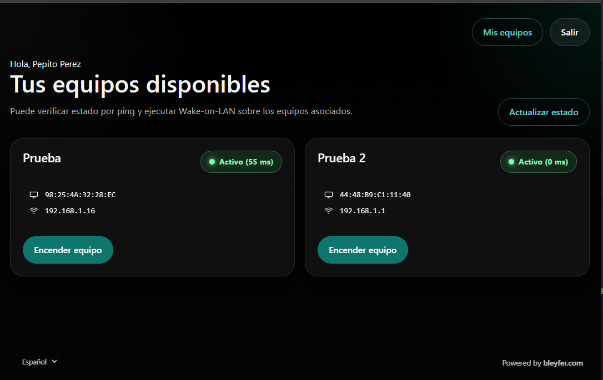
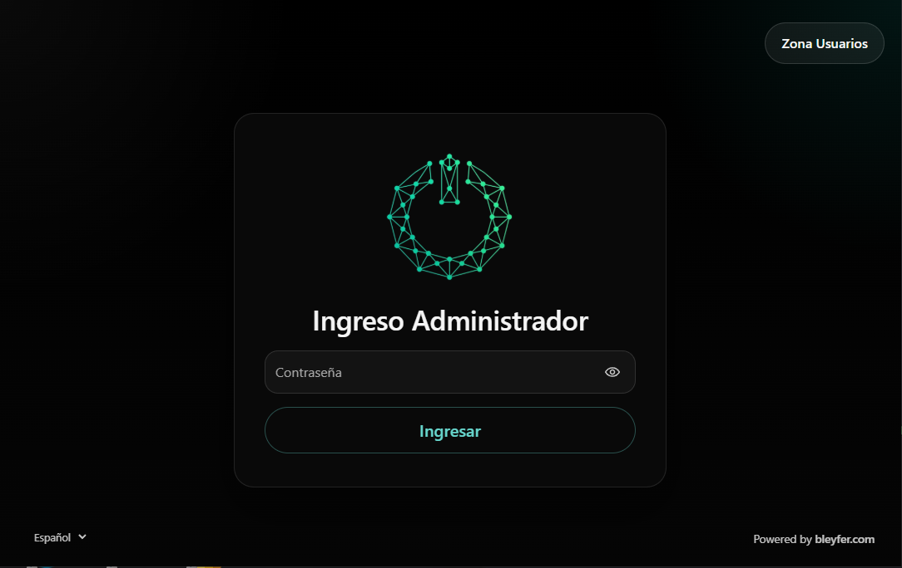
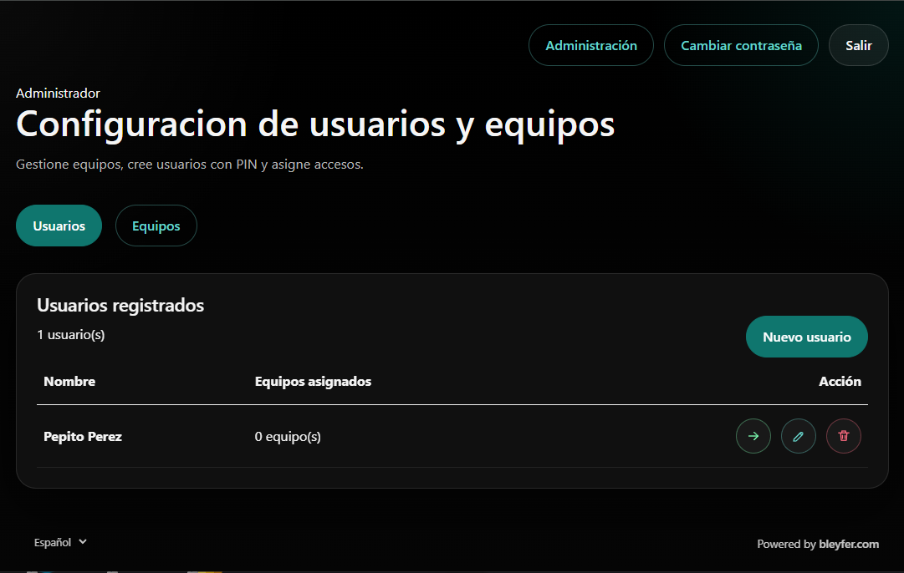
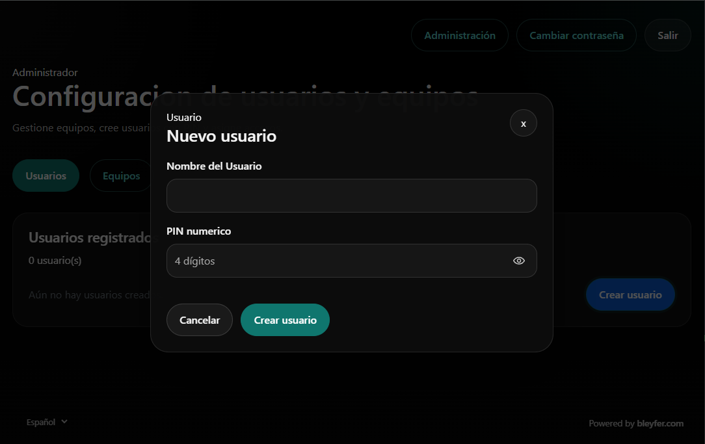
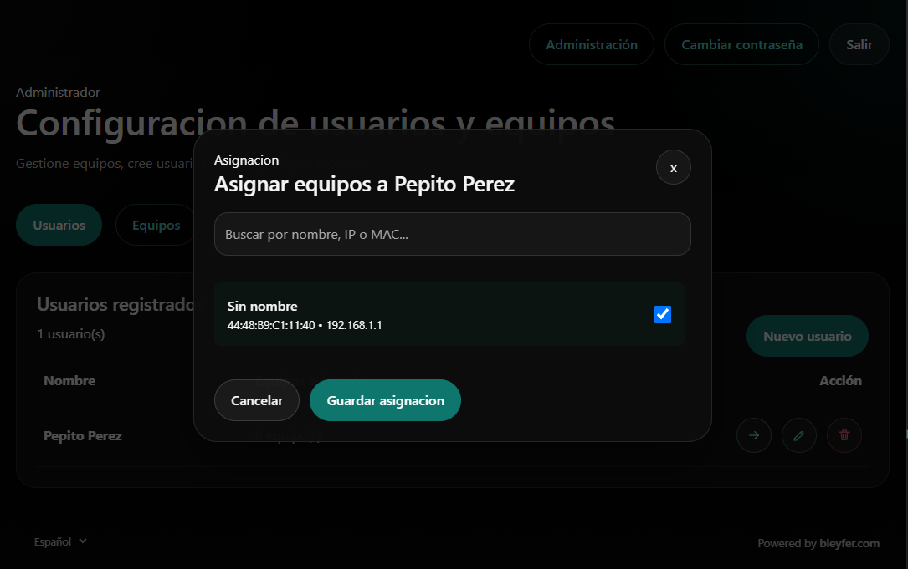
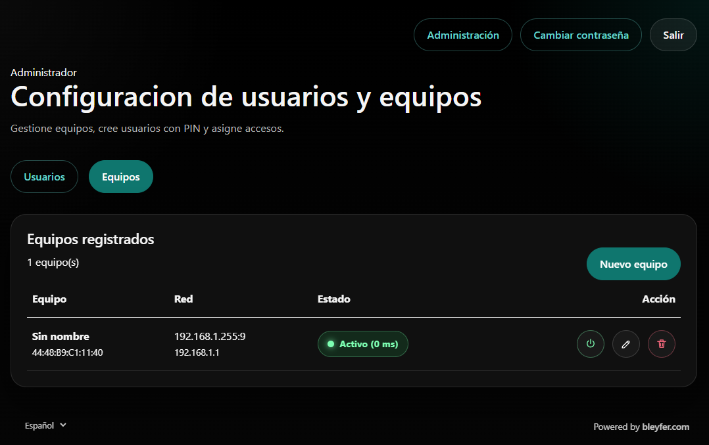
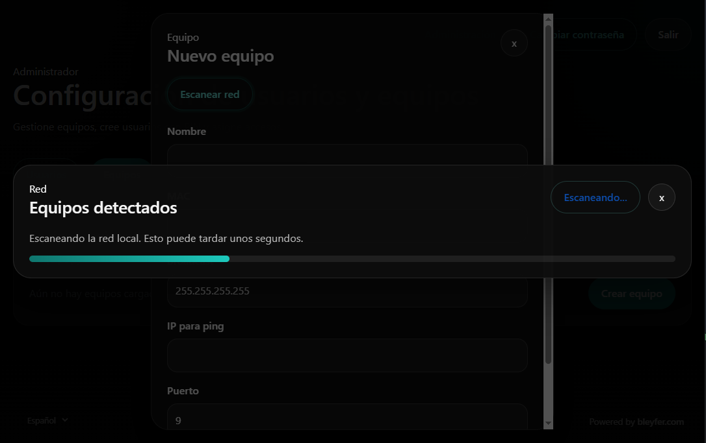
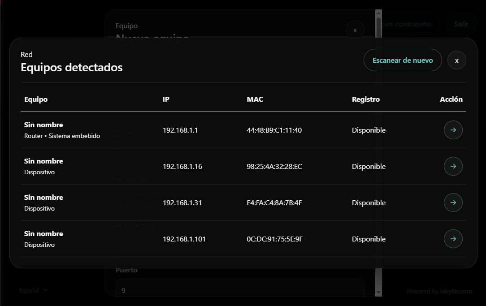

# Wake On LAN Web 🚀

¡Bienvenido al **Wake On LAN Web**! Esta aplicación web moderna e intuitiva permite a administradores y usuarios gestionar, monitorear y encender equipos de forma remota a través de la red local enviando paquetes mágicos (Magic Packets) de Wake-on-LAN (WOL).

## ✨ Características Principales

*   **⚡ Encendido Remoto (Wake-on-LAN):** Enciende fácilmente computadoras y servidores con un solo clic.
*   **🌍 Multi-idioma (Español / Inglés):** Soporte nativo para múltiples idiomas. La interfaz de usuario, las validaciones de formularios y las notificaciones se adaptan al idioma seleccionado, recordando la preferencia del usuario en una Cookie de forma persistente.
*   **🔍 Escaneo Automático de Red:** Herramienta integrada para escanear y descubrir dispositivos en la red local mediante peticiones ARP/Ping.
*   **👥 Gestión de Usuarios y Permisos:** 
    *   **Panel de Administrador:** Protegido con contraseña, permite gestionar todos los equipos, crear accesos de usuario (PIN) y configurar la red.
    *   **Portal de Usuario:** Acceso simplificado mediante un PIN de 4 dígitos. Cada usuario solo ve y puede encender los equipos que el administrador le haya asignado explícitamente.
*   **📡 Monitoreo de Estado en Tiempo Real:** Visualización en vivo (mediante ping constante) de qué equipos están `Activos` o `Inactivos`, mostrando también el tiempo de respuesta en milisegundos (ms).
*   **🎨 Diseño Moderno "Dark Mode":** Interfaz de usuario elegante, fluida y totalmente responsiva diseñada para un uso cómodo en cualquier dispositivo.

## 📸 Vistazo a la Aplicación

*(Las siguientes imágenes ilustran el funcionamiento del sistema en diferentes vistas y funciones).*

### 1. Inicio de Sesión de Usuario Estándar

*Pantalla para ingresar el PIN de acceso del usuario estándar.*

### 2. Portal de Usuario

*Al ingresar el PIN, el usuario solo verá y podrá encender los equipos que le han sido asignados.*

### 3. Login del Administrador

*Acceso al panel de administración para gestionar usuarios, equipos y configuraciones. (Contraseña por defecto: 12345678).*

### 4. Gestión de Usuarios

*Panel para crear, editar, eliminar y administrar los usuarios del sistema.*

### 5. Creación de Usuario

*Modal para registrar un nuevo usuario definiendo su nombre y PIN de acceso.*

### 6. Asignación de Equipos a Usuarios

*Opciones para vincular los equipos de la red a un usuario específico (se realiza después de crear al usuario).*

### 7. Configuración de Equipos

*Panel completo para anexar equipos, editarlos, eliminarlos e incluso enviar el comando de encendido manual.*

### 8. Escaneo Automático de Red

*Herramienta integrada para escanear y descubrir dispositivos en la red local mediante peticiones ARP/Ping.*

### 9. Resultados del Escaneo

*Listado de los equipos descubiertos tras ejecutar el escáner de red, listos para ser agregados.*

## 🚀 Guía de Instalación y Uso

### Prerrequisitos
*   Asegúrate de que las computadoras a encender tengan **Wake-on-LAN (WOL)** habilitado en la configuración de la BIOS/UEFI y en las propiedades del adaptador de red del Sistema Operativo.

### Instalación en Windows

1. Descarga el instalador **`Wake On Lan-Setup.exe`** desde la sección de *Releases*.
2. Ejecuta el instalador y sigue los pasos del asistente en pantalla para instalar el portal en tu servidor o equipo Windows. El instalador cuenta con multi-idioma nativo.
3. Una vez instalado, el servicio web iniciará automáticamente en segundo plano. Puedes acceder a la aplicación navegando a `http://localhost:5100` (o el puerto configurado).

### Instalación y Actualización en Linux / Raspberry Pi

El sistema cuenta con soporte nativo y optimizado para ejecutarse como un servicio (Daemon) en servidores Linux y dispositivos IoT como Raspberry Pi (x64, ARM y ARM64), consultando directamente la tabla ARP del kernel (`/proc/net/arp`) para una perfecta compatibilidad.

La instalación se ha automatizado mediante un script profesional que detecta tu arquitectura, descarga la última versión desde GitHub y configura automáticamente el servicio `systemd`.

Para **Instalar** o **Actualizar** el sistema, ejecuta el siguiente comando en la terminal de tu servidor Linux:

```bash
curl -sSL https://raw.githubusercontent.com/bleyfer/Wake-On-Lan/main/install.sh | sudo bash
```

> [!TIP]
> **Actualización Segura:** Este mismo comando actúa como un actualizador inteligente. Si ya tienes el sistema instalado y ejecutas este comando, el script detectará si hay una nueva versión, creará un respaldo de tu base de datos automáticamente, actualizará los archivos y restaurará tu información sin que pierdas ningún dato.

*Nota: Al finalizar el script, la aplicación estará corriendo en segundo plano y podrás acceder a través de tu navegador.*

### Primer Acceso (Administrador)
Al iniciar la aplicación por primera vez, el sistema creará automáticamente su base de datos local con credenciales predeterminadas. La **contraseña de administrador por defecto es `12345678`** (no se requiere usuario). ¡Asegúrate de iniciar sesión y cambiarla inmediatamente desde la configuración de tu perfil para mantener tu red segura!

## 🌍 Soporte Multi-idioma Automático

La aplicación cuenta con soporte completo y dinámico para **Español** e **Inglés**. Todas las interfaces, textos, validaciones de formularios (como longitud de contraseñas y pines requeridos) y notificaciones emergentes se traducen de manera automática al instante.

El idioma puede cambiarse en cualquier momento desde el selector en la esquina inferior izquierda, y el sistema recordará la preferencia de cada dispositivo de forma automática.

## 🛠️ Tecnologías Utilizadas
*   **Framework:** ASP.NET Core 8.0 (Blazor Server)
*   **Base de datos:** SQLite con Entity Framework Core
*   **Seguridad:** Cookie Authentication y Claims

---
*Desarrollado con ❤️ para facilitar la administración remota de hardware.*
